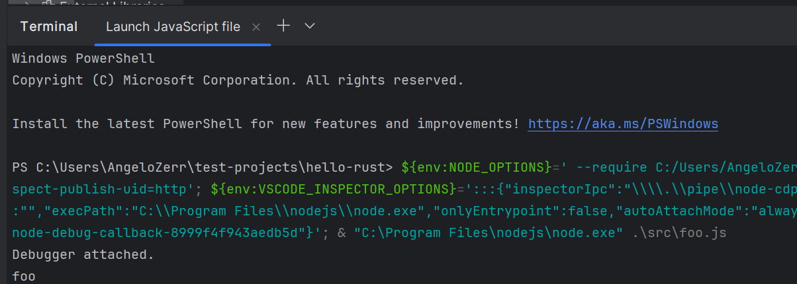
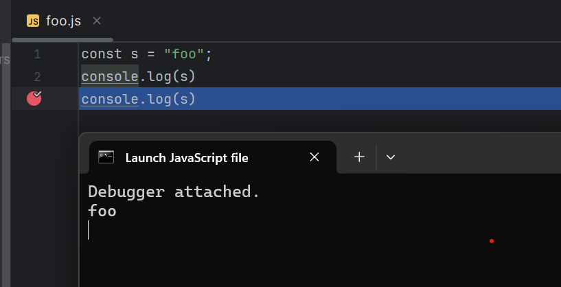
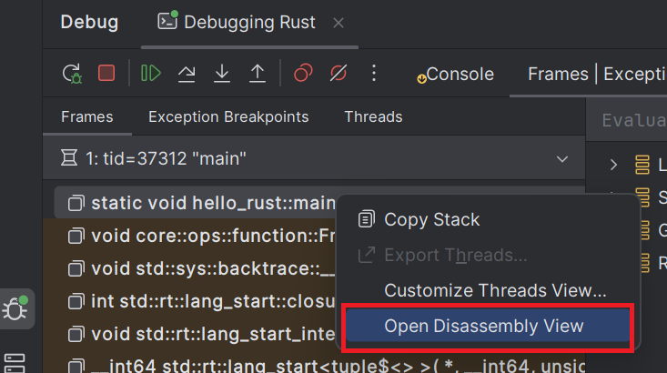
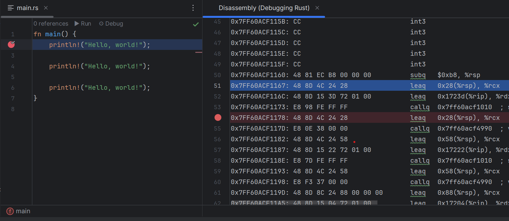
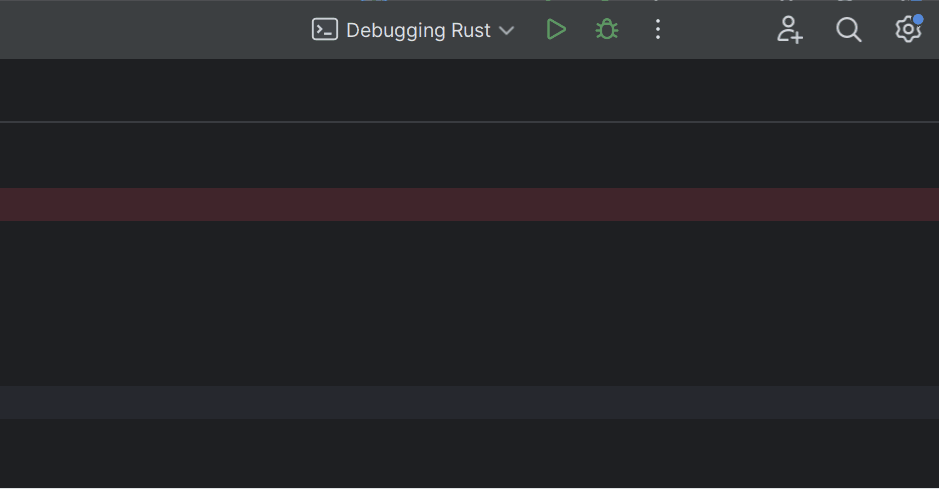

# Debug Adapter Protocol

LSP4IJ provides [Debug Adapter Protocol](https://microsoft.github.io/debug-adapter-protocol/) support. 
You can read [the DAP Support overview](./DAPSupport.md), describing which DAP features are implemented, and how.
If you need to customize the DAP support you can [register your DAP server with extension point](./DeveloperGuide.md).

The DAP support is available with the `Debug Adapter Protocol` run/debug configuration type:


After configuring the [DAP configuration type](#dap-configuration-type), you can debug your file.

Here is an example with `JavaScript debugging`, which uses the [VSCode JS Debug DAP server](./user-defined-dap/vscode-js-debug.md):


## DAP Configuration Type:

To configure debugging with DAP, you need to fill in:

### Server tab

The `Server` tab to specify the DAP server:

  

### Mappings tab

The `Mappings` tab to specify the files which can be debugged to allow adding/removing breakpoints:


### Configuration tab

The `Configuration` tab to specify the working directory and the file you want to run/debug:

  

## Breakpoints

### Adding breakpoint

When a file can be debugged using a DAP server specified in the [Mappings tab](#mappings-tab), a breakpoint can be added.


### Verify breakpoint

When the DAP server starts, breakpoints are sent to it, and it responds with the status of those breakpoints — 
whether they are validated or not.

For example, when the DAP server [VSCode JS Debug](./user-defined-dap/vscode-js-debug.md) starts, it invalidates all breakpoints.:


When the program starts, it checks and validates the breakpoints.


### Conditional breakpoint

Conditional breakpoints are also supported. Here is an example of a conditional breakpoint written in JavaScript:


### Exception breakpoint

Some DAP servers support exception breakpoints. If so, you must first run the configuration process, 
which starts the DAP server and retrieves the list of available exception breakpoints. 
This list is accessible through the `Exception Breakpoints` menu:


The first time, the selected exception breakpoints 
are based on the default configuration provided by the DAP server.

You can then select or deselect the exception breakpoints you want to use.

Take a sample JavaScript file containing an error:


In this example, no breakpoints are defined. 
However, when you start the DAP server, it stops at the line with the line error:


This happens because `Caught Exceptions` is selected.

## Inline value

The values of the variables are displayed inline, but this is not perfect because a DAP server generally cannot handle variable positions (only their values). 
To retrieve the variable positions, LSP4IJ uses the syntax highlighting information from the editor (TextMate or others).

Here a de demo with JavaScript:


Theoretically, inline values should be handled by a language server via [textDocument/inlineValue](https://microsoft.github.io/language-server-protocol/specifications/lsp/3.17/specification/#textDocument_inlineValue)
but as no language servers seems implement this LSP request for the moment LSP4IJ doesn't use this strategy.

## Evaluate expression

Evaluate expression is available by consuming the [Evaluate request](https://microsoft.github.io/debug-adapter-protocol//specification.html#Requests_Evaluate) 


### Completion

If debug adapter [supports the `completions` request](https://microsoft.github.io/debug-adapter-protocol//specification.html#Types_Capabilities),
completion should be available in the expression editor by consuming the
[Completion request](https://microsoft.github.io/debug-adapter-protocol//specification.html#Requests_Completions):


## Set value

If debug adapter [supports setting a variable to a value](https://microsoft.github.io/debug-adapter-protocol//specification.html#Types_Capabilities),
the `Set Value...` contextual menu should be available: 


You should edit the variable:


the edit apply will consume the
[SetVariable request](https://microsoft.github.io/debug-adapter-protocol//specification.html#Requests_SetVariable):

## Run In Terminal

If the DAP server supports the [Run In Terminal](https://microsoft.github.io/debug-adapter-protocol/specification.html#Reverse_Requests_RunInTerminal) request, **LSP4IJ** can handle it automatically.  
This feature allows launching a debug session in either the `integrated terminal` or an `external terminal`.

Most DAP servers let you choose which terminal to use through the `console` field in the launch parameters:

- `"console": "integratedTerminal"` → Use the IDE's integrated terminal
- `"console": "externalTerminal"` → Open a separate external terminal window

The [VS Code JS Debug](./user-defined-dap/vscode-js-debug.md) adapter supports `Run In Terminal`. Below are two sample configurations:

### Integrated terminal

Here a sample with VSCode JS Debug and `integratedTerminal`:

```json
{
  "type": "pwa-node",
  "name": "Launch JavaScript file",
  "request": "launch",
  "program": "${file}",
  "cwd": "${workspaceFolder}",
  "console": "integratedTerminal"
}
```



### External terminal

Here a sample with VSCode JS Debug and `externalTerminal`:

```json
{
  "type": "pwa-node",
  "name": "Launch JavaScript file",
  "request": "launch",
  "program": "${file}",
  "cwd": "${workspaceFolder}",
  "console": "externalTerminal"
}
```



The `externalTerminal` is supported on **Windows** and **Linux**, but **not on macOS**.

## Disassemble

If the DAP server [supports disassembly](https://microsoft.github.io/debug-adapter-protocol//specification.html#Requests_Disassemble), open the Disassembly view from the stack trace context menu: `Open Disassembly View`.



The Disassembly view shows the instructions for the current stack frame. You can add breakpoints and step through instructions one by one.



You can switch between source files and the Disassembly view at any time to continue step-by-step debugging.

Example: using [CodeLLDB](./user-defined-dap/codelldb.md) to debug a Rust executable built with `cargo build`.



## Contextual Menu

Click on right button open existing / new DAP run configuration:


## DAP server traces

If you wish to show DAP request/response traces when you will debug:


you need to select `Trace` with `verbose`.


## DAP settings

You can `create/remove/update` DAP servers with `Debug Adapter Protocol` entry:


## Templates

LSP4IJ provides DAP templates that allow to initialize a given DAP server very quickly:

- [CodeLLDB](./user-defined-dap/codelldb.md) which allows you to debug `Rust`,`Swift`, etc. files.
- [Go Delve DAP server](./user-defined-dap/go-delve.md) which allows you to debug `Go` files.
- [Julia DAP server](./user-defined-dap/julia.md) which allows you to debug `Julia` files. 
- [Python Debugpy DAP server](./user-defined-dap/python-debugpy.md) which allows you to debug `Python` files.
- [Ruby rdbg DAP server](./user-defined-dap/ruby-rdbg.md) which allows you to debug `Ruby` files.
- [Swift DAP Server](./user-defined-dap/swift-lldb.md) which allows you to debug `Swift` files.
- [VSCode JS Debug DAP Server](./user-defined-dap/vscode-js-debug.md) which allows you to debug `JavaScript/TypeScript` files.